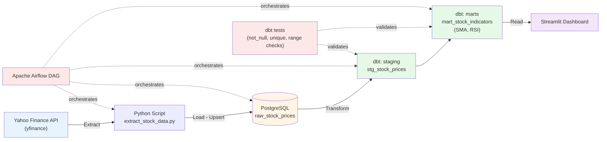

# 📈 Stock ETL Pipeline

A little ETL pipeline I built to track the stocks in my own portfolio (SNDK, ASTS, JNJ, GOOGL, VRT, NVDA, RKLB) — and to teach myself how a real data pipeline actually gets put together, end to end.

I'm a recent CS grad moving from data analytics into data engineering, and I wanted a project that wasn't just "load a CSV into pandas and make a chart." This one pulls live stock prices every day, pushes them through a proper database, transforms them with dbt, gets orchestrated by Airflow, and lands on a dashboard I actually check.

---

## What it does

Every weekday after the US market closes, the pipeline:

1. Pulls the day's OHLCV data for my 7 tickers from Yahoo Finance
2. Loads it into Postgres — safely, so running it twice never creates duplicates
3. Cleans and transforms it with dbt, calculating a 5-day SMA and 14-day RSI
4. Runs 13 automated tests to make sure nothing looks broken (no negative prices, no duplicate rows, RSI actually between 0–100, etc.)
5. Shows it all on a Streamlit dashboard

All of it is wired together and scheduled with Airflow, so I can just trigger it and watch it run.

---

## Architecture



---

## Tech stack

| Layer | Tool | Why I picked it |
|---|---|---|
| Orchestration | Apache Airflow | The industry-standard way to schedule and monitor pipelines — wanted hands-on experience, not just cron |
| Extraction | Python + yfinance | Free, reliable enough for daily OHLCV data |
| Database | PostgreSQL | Solid, well-documented, plays nicely with dbt |
| Transformation | dbt-core | SQL-first transformations with built-in testing and documentation |
| Visualization | Streamlit + Plotly | Fast to build, I already knew it from a previous project |
| Containers | Docker Compose | Makes the whole thing reproducible on any machine |

---

## Running it yourself

You'll need Docker Desktop and Python 3.10+.

```bash
git clone https://github.com/loltentku/stock-etl-pipeline.git
cd stock-etl-pipeline

# spin up Airflow + Postgres
docker compose up -d
```

Then open **http://localhost:8080** (login: `airflow` / `airflow`), unpause the `stock_etl_pipeline` DAG, and trigger it.

To check the dbt tests:

```bash
cd dbt_project
dbt deps
dbt test
```

To see the dashboard:

```bash
pip install streamlit plotly sqlalchemy psycopg2-binary
streamlit run dashboard.py
```

---

## Project structure

```
stock-etl-pipeline/
├── dags/
│   └── stock_pipeline_dag.py       # Airflow DAG: extract -> load -> dbt run
├── scripts/
│   ├── extract_stock_data.py       # Pulls data from yfinance
│   └── load_stock_data.py          # Upserts into Postgres
├── dbt_project/
│   └── models/
│       ├── staging/                # Cleaned staging models + tests
│       └── marts/                  # SMA/RSI indicator models + tests
├── dashboard.py                    # Streamlit dashboard
├── docker-compose.yml
└── .gitignore
```

---

## Things I made a point of getting right

A few decisions here weren't obvious to me at first — I picked them up while building this, so they're worth writing down:

- **Idempotency.** The load step uses `INSERT ... ON CONFLICT DO UPDATE` with a `UNIQUE (ticker, date)` constraint at the database level. I broke this a couple of times early on (ran the DAG twice and ended up with duplicate rows) before switching to this pattern — now re-running the pipeline is always safe.
- **Staging vs. marts.** I kept the `staging` layer dumb on purpose — just cleaning and type casting, no business logic. All the SMA/RSI calculation happens downstream in `marts`. This is a dbt convention, and once I understood *why* (so you always know where to look for a given piece of logic), it made the whole project easier to reason about.
- **SQL window functions instead of pandas loops.** SMA and RSI are computed with `AVG() OVER (PARTITION BY ticker ORDER BY date ROWS BETWEEN ...)` rather than looping through rows in Python. Slower to get right the first time, but it's the pattern that actually scales.
- **Tests aren't optional.** The 13 dbt tests aren't for show — they caught a real bug during development (a couple of RSI values were coming out slightly outside 0–100 because of a divide-by-zero edge case when there were no losses in the window).

---

## What I'd add next

- Deploy the dashboard properly (Streamlit Community Cloud, reading from a scheduled data export instead of a live DB connection)
- CI with GitHub Actions to run `dbt test` on every push
- A streaming version using Kafka, just to compare the batch vs. streaming experience
- More indicators (MACD, Bollinger Bands) and maybe some basic backtesting

---

Built by [loltentku](https://github.com/loltentku) — feel free to poke around, fork it, or point out something I got wrong.
